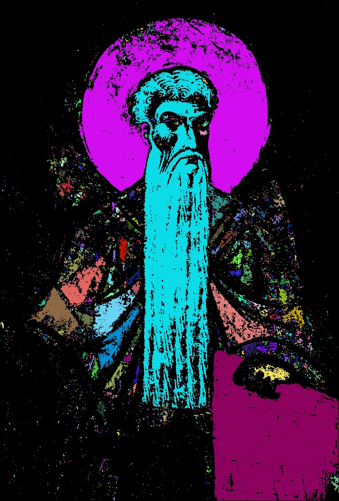

# CCL: Connected Components Labelization

## SCT: Scan plus Connection Table

SCT is the most simple CCL algorithm. It uses a connection table to remember the conflict between pixels of different sets.
The label equivalences is propagated through that table.

|   Test image                      Result            |
|:------------------------------------------------------:|
|  |
